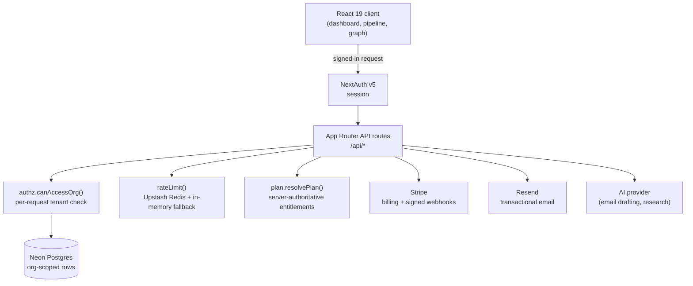

# ChaiRaise

**AI-native fundraising CRM for mission-driven organizations. Multi-tenant, server-authoritative billing, secure by construction.**

[](https://github.com/YGK13/chairaise/actions/workflows/test.yml)


Live: [chairaise.com](https://chairaise.com)

ChaiRaise turns a fundraising team's donor pipeline into an AI-assisted operating system: AI-drafted donor emails, a Kanban pipeline, CSV import and export, deep org-intelligence research, cause-match scoring and social-graph mapping, all gated by a billing tier the server enforces authoritatively.

---

## Architecture

A single Next.js 16 App Router application. The UI, the API and the auth all run in one deployment on Vercel, backed by serverless Neon Postgres.



**Request lifecycle for any data route:** authenticate the session (NextAuth), resolve the caller's plan server-side (`lib/plan.js`), enforce the per-endpoint rate limit (`lib/rateLimit.js`), verify the caller may touch the requested tenant (`lib/authz.js`), then run the org-scoped SQL. The client never decides its own plan or tenant access. It renders only what the server already granted.

---

## Why it's built this way (the decisions that matter)

**Multi-tenancy is enforced, not assumed.** Data routes are scoped by an `org_id` the client supplies, so a naive implementation would let any caller read another org's donors by guessing an id. `canAccessOrg()` (`lib/authz.js`) closes that: owner emails always pass, an org with zero registered members is a **hard deny** (a guessable or un-onboarded id is never "safe to leave open"), and otherwise the caller must be a registered member of that org by email. There is no code path where an unknown `org_id` falls through to data.

**Entitlements are server-authoritative and isomorphic.** `lib/plan.js` is the single source of truth for the plan ladder. API routes call `resolvePlan(email, stripeStatus)` to decide a plan authoritatively and enforce limits and features. The client receives the resolved plan id and calls `can()` / `limitFor()` only to decide what to render. What the landing page sells is exactly what the server enforces, so the UI can never grant a feature the account didn't pay for.

**Rate limiting survives serverless cold starts.** `lib/rateLimit.js` uses an Upstash Redis backend when configured (durable across Vercel edge and serverless instances) and degrades gracefully to a per-instance in-memory bucket when it isn't, so abusive traffic on the AI and email endpoints is capped without a hard external dependency.

**Stripe webhooks are signature-verified.** Billing state changes arrive through a dedicated verified webhook route (`/api/billing/webhook`) rather than trusting client claims about subscription status.

---

## Stack

| Layer | Choice |
|---|---|
| Framework | Next.js 16 (App Router), React 19 |
| Auth | NextAuth v5 |
| Database | Neon serverless Postgres (`@neondatabase/serverless`) |
| Billing | Stripe (subscriptions + signed webhooks) |
| Email | Resend |
| Rate limiting | Upstash Redis with in-memory fallback |
| Tests | Vitest + Testing Library |
| Hosting | Vercel |

## Core libraries (`lib/`)

| File | Responsibility |
|---|---|
| `db.js` | Neon connection + schema init |
| `auth.js` | NextAuth configuration |
| `authz.js` | Per-request multi-tenant access control |
| `plan.js` | Plan ladder, features and limits (server-authoritative) |
| `rateLimit.js` | Durable per-endpoint rate limiting |
| `graph.js` | Donor social / network graph |
| `ai.js` | AI email drafting and research calls |
| `csv.js` | Donor CSV import / export |
| `drip-client.js` | Drip campaign enrollment and events |
| `storage.js` / `useData.js` | Client data access hooks |

## API surface (`app/api/`)

`auth` · `orgs` · `donors` (+ `donors/[id]`) · `donations` · `ai` · `research` · `billing` (+ `billing/webhook`) · `email` · `contact` · `drip/enroll` · `drip/event` · `setup` · `health`

---

## Local development

```bash
npm install
cp .env.example .env.local   # fill in the values, see below
npm run dev                  # http://localhost:3000
```

Required environment (see `.env.example` for the full list): `DATABASE_URL` (Neon), `NEXTAUTH_SECRET`, Stripe keys + webhook secret, `RESEND_API_KEY`, and optional `UPSTASH_REDIS_*` for durable rate limiting. No secrets are committed. The app fails fast with a clear error if a required variable is missing.

## Tests

```bash
npm test          # vitest run (CI runs this on every push and PR)
npm run test:watch
```

97 unit tests cover the security- and money-critical libraries: plan resolution and entitlements (`plan.test.js`), CSV round-tripping (`csv.test.js`), the donor graph (`graph.test.js`), AI helpers (`ai.test.js`) and shared constants (`constants.test.js`).

---

## License

Proprietary. All rights reserved. Public for portfolio and review purposes; not licensed for reuse.
